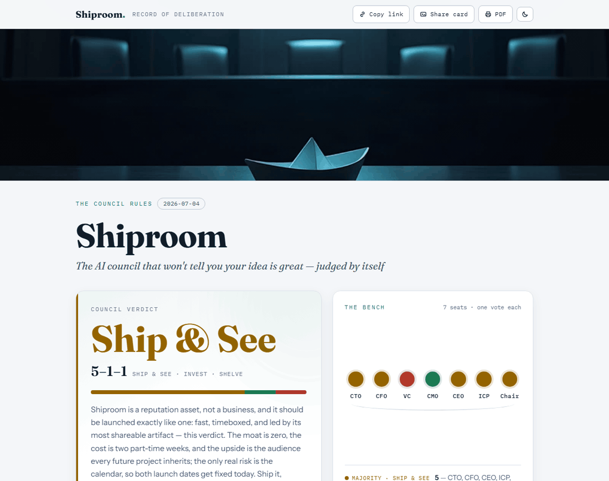
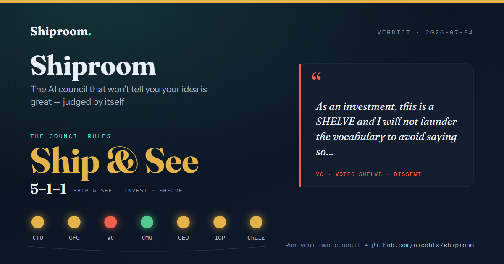

# Shiproom

**The go/no-go room for your idea — an AI council that won't tell you it's great.**

[](./LICENSE)
[](./docket/001-shiproom/)
[](https://agentskills.io)
[](https://github.com/nicobts/shiproom/actions/workflows/validate.yml)

[**Site**](https://nicobts.github.io/shiproom/) · [**A real verdict**](https://nicobts.github.io/shiproom/docket/001-shiproom/) · [Install](#install--as-a-skill-in-any-coding-agent) · [The Docket](#the-docket) · [Contributing](./CONTRIBUTING.md) · [Roadmap](./ROADMAP.md)

**English** · [简体中文](./i18n/README.zh-CN.md) · [日本語](./i18n/README.ja.md) · [Español](./i18n/README.es.md) · [Italiano](./i18n/README.it.md) · [Français](./i18n/README.fr.md) — [add your language](./i18n/)

Ask an AI to evaluate your project and you get flattery. Ask the Council and you get
seven adversarial seats — CTO, CFO, VC, CMO, CEO, your target customer, and a Chair —
each mandated to find the strongest reason your project *fails* before saying what would
change its mind. Every seat must end with a vote (`INVEST` / `SHIP_AND_SEE` / `SHELVE`),
a flip condition, and one concrete action. The output is a committed verdict you're not
allowed to soften, rendered as an interactive verdict page.

<p align="center">
  
</p>

> **It judged itself first.** I ran the Council on this repo before launching.
> Verdict: **Ship & See, 5–1–1** — the VC voted to SHELVE it ("no revenue mechanism,
> no moat, and I will not launder the vocabulary to avoid saying so"). The dissent is
> the product working. [Read Docket entry #001](./docket/001-shiproom/) or
> [open the live verdict page](https://nicobts.github.io/shiproom/docket/001-shiproom/).

## What you get

Every run produces a verdict page: the ruling and its tally, the bench as seven lights,
the dissent pulled to the front, and each seat's argument with its key number, flip
condition and one action — the full written filing one click deeper. One self-contained
HTML file, dark or light, no build step, no accounts, no telemetry.

<p align="center">
  <picture>
    <source media="(prefers-color-scheme: dark)" srcset="assets/verdict-page-dark.png">
    
  </picture>
</p>

Each verdict also renders a share card — the decision, the tally, the bench, and the
dissent in the dissenter's own words:

<p align="center">
  
</p>

## Install — as a skill, in any coding agent

Shiproom is a standard [Agent Skill](https://agentskills.io): one self-contained folder,
`skills/shiproom/`, that any skills-aware agent can load. Pick one:

**Claude Code — plugin**

```
/plugin marketplace add nicobts/shiproom
/plugin install shiproom@shiproom
```

**Claude Code, Codex, Cursor, Gemini CLI, OpenCode, Copilot and more — via the
[skills CLI](https://github.com/vercel-labs/skills)**

```bash
npx skills add nicobts/shiproom            # this project
npx skills add nicobts/shiproom --global   # every project
```

`npx skills update` and `npx skills remove shiproom` handle upgrades and uninstall.

**By hand** — copy `skills/shiproom/` into your agent's skills folder:
`.claude/skills/` for Claude Code, `.agents/skills/` for Codex, Cursor, Gemini CLI and
OpenCode (or the user-level equivalent, e.g. `~/.claude/skills/`).

**Zero install** — paste [`SHIPROOM.md`](./SHIPROOM.md) into any capable AI along with a
description of your project. That's the whole setup; the repo version adds web-verified
fact bases, structured `verdict.json` output, and the verdict page.

Nothing is written to your project except the council's own state in `.council/`. Your
`AGENTS.md`, `CLAUDE.md` and other files are never touched.

## The five-step flow

```
/shiproom scope    the Clerk interviews you (one question at a time), seats the bench
/shiproom run      the deliberation — seat-by-seat, progress headers, resume-safe
/shiproom grill    the appeal — seats question YOU; answers can flip votes
/shiproom verdict  render the verdict page
/shiproom docket   package it for the public Docket
```

State lives in `.council/`, so you can quit mid-grill tonight and resume at the same seat
tomorrow. In agents without slash commands, ask for it in words — "run the Shiproom on
this project" — and your agent follows the same flows. It argues in your language: an
Italian founder's council deliberates in Italian.

**Grill mode** judges *you* rather than your documents: each seat questions you directly,
answers must be numbers, facts, names or decisions, and dodging twice records the
question verbatim as an **open wound** in your verdict. Frank, not cruel — the protocol
bans insults and theatrics. See [`references/GRILL.md`](./skills/shiproom/references/GRILL.md).

## Why this works when "be brutally honest" doesn't

Prompt-level honesty collapses back into agreement within a couple of turns — the model
wants to please you, whatever costume it wears. The Council attacks the problem
structurally:

1. **Kill mandates** — each seat must argue the failure case first.
2. **A sourced fact base** — claims without sources are struck; unverifiable numbers
   are labeled ESTIMATE.
3. **Forced engagement** — every seat must explicitly agree or disagree with a prior
   seat, by name.
4. **Pre-committed verdicts** — votes, flip conditions, and thresholds written before
   you know the outcome, never edited after.
5. **The unanimity alarm** — a unanimously cheerful run is treated as a failed run.

## The helper script

The deliberation runs in *your* agent. A zero-dependency Node 18+ script inside the
skill handles the deterministic parts, and the skill tells your agent when to call it:

```
node skills/shiproom/scripts/shiproom.js validate   check verdict.json against the schema and protocol rules
node skills/shiproom/scripts/shiproom.js view       serve the verdict page on 127.0.0.1
node skills/shiproom/scripts/shiproom.js card       1200×630 share card (--png for social previews)
node skills/shiproom/scripts/shiproom.js docket     package a verdict for the public Docket
node skills/shiproom/scripts/shiproom.js canary     drift check on a run of the flawed fixture
```

`canary` is the anti-sycophancy test: run the council on
[`references/canary/FIXTURE.md`](./skills/shiproom/references/canary/FIXTURE.md) with any
new model — if the verdict comes back cheerful, the protocol failed, not passed.

> **Note — npm.** Shiproom is not published to npm, and the unscoped name `shiproom`
> belongs to an unrelated package: never run `npx shiproom`. If a standalone CLI is
> published later, it will be under a scoped name such as `@nicobts/shiproom`.

## The Docket

Published verdicts, starting with my own. Ran the Council and willing to show the
scars? PR your verdict folder into `docket/` — SHELVE verdicts especially welcome;
getting roasted well is a badge of honor.

| # | Project | Verdict | Tally |
|---|---------|---------|-------|
| 001 | [Shiproom (this repo)](./docket/001-shiproom/) | Ship & See | 5–1–1, VC dissenting |

## Honest limitation

All seven seats run on the same model, so the Council structures your decision and
forces pre-commitment — it cannot replace real market contact. Treat its verdict as a
hypothesis and its thresholds as the experiment that tests it. And model behavior
drifts: the repo ships a fixture project with a known honest verdict as a drift canary —
if a new model returns unanimous cheerfulness on it, the protocol needs tightening, not
celebrating.

## Contributing

A translation is the easiest first PR; a new seat is a ~30-line markdown file (mandate,
kill question, verdict semantics), and a published verdict is the most welcome of all.
See [CONTRIBUTING.md](./CONTRIBUTING.md) for the invariants, the repository layout and
how changes land. What's next is in [ROADMAP.md](./ROADMAP.md).

## About

I'm Nicolas — a solo builder working nights and weekends. This protocol came out of
validating one of my own side projects: I wanted an evaluation I couldn't sweet-talk.
The council's first verdict — on itself — is in the [Docket](./docket/), unedited,
including the seat that voted against this repo existing. If it's useful to you, a star
helps others find it, and a published verdict in the Docket helps even more.
Say hi on [LinkedIn](https://www.linkedin.com/in/nicolas-bossi-26a326b3/) or write to
[nicolasbossi@gmail.com](mailto:nicolasbossi@gmail.com).

## License

MIT
